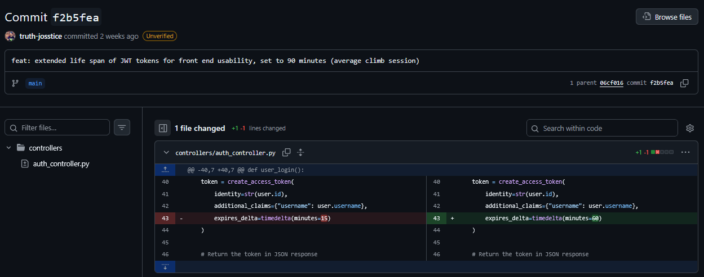
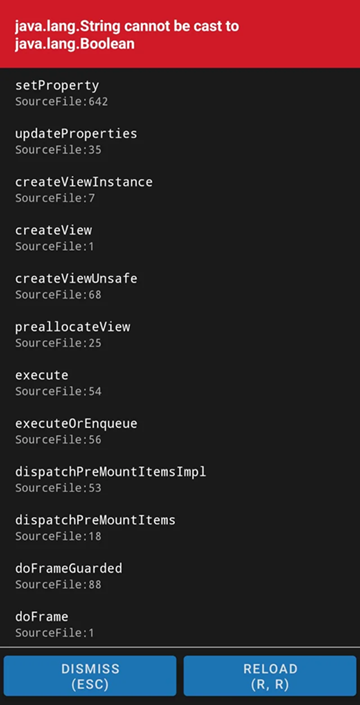
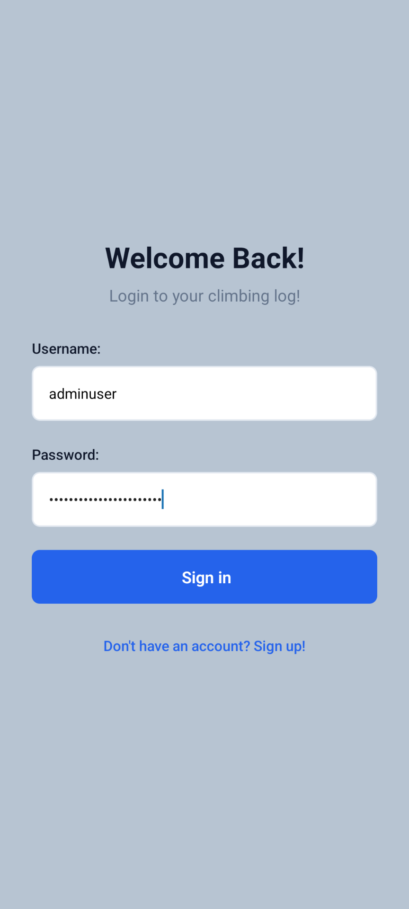
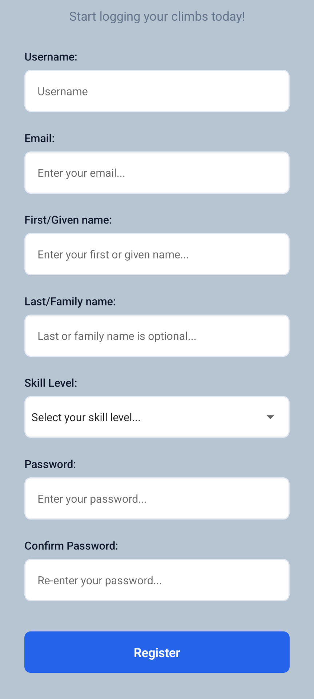
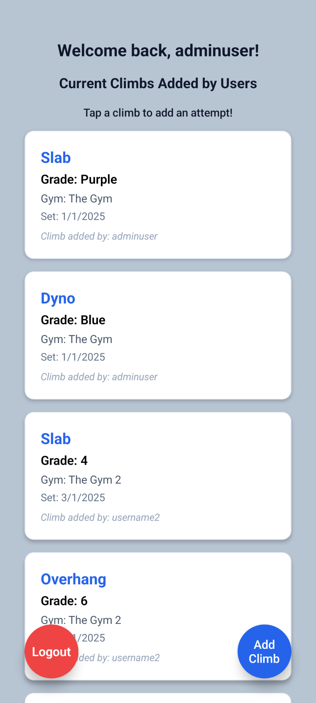
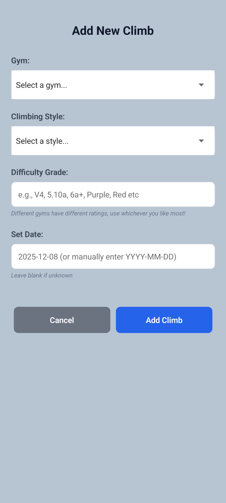
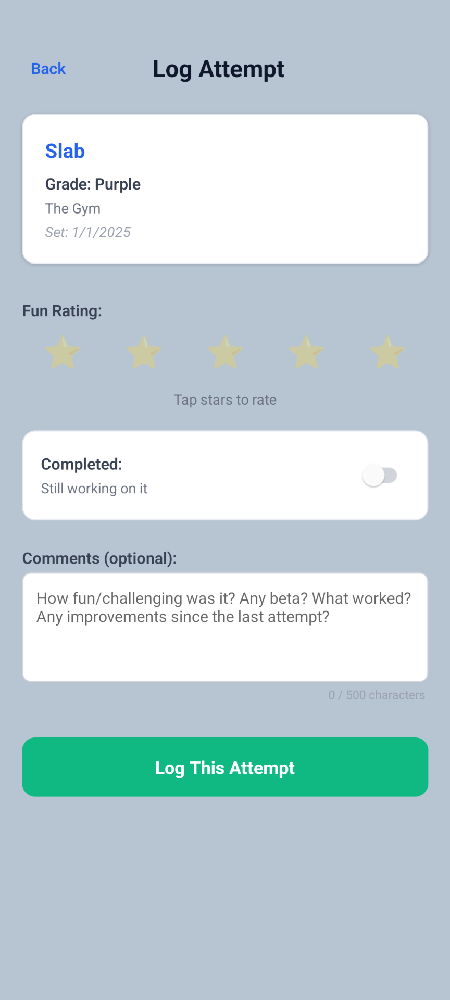

# Busting the Plateau: A Beginner's Guide to Ethical App Development

_Building a privacy aware bouldering tracker as a beginner developer, and how to create a simple niche application!_

## The Problem: Why I Built My Own App

### _The Dual Pitfalls: Motivation and Data Privacy_

Bouldering is a complicated sport, and a large number of people experience what is commonly referred to as "the plateau", a point at which progress becomes harder to achieve, and harder to notice. As someone who is currently right in the middle of the plateau, I find it harder and harder to notice incremental improvements from each session. Something I experienced when using apps like [Top Logger](https://toplogger.nu/en) or researching others like [Mountain Project](https://www.mountainproject.com/) or [8a.nu](https://www.8a.nu/), I noticed a design pattern: the listed v-grade often felt lower than my subjective experience (this is called sandbagging in the bouldering community, when a climb is difficult, but graded as easy), the app was tailored to outdoor or advanced climbing (and was difficult to digest for beginner climbers), or driven by subscription services and ads. I found that none of them really helped my climbing, and deepened the feeling of "getting nowhere". As the majority of climbers in the beginner and intermediate levels likely don't climb outdoors (due to financial and time commitments associated) I found myself looking for applications that were tailored to indoor bouldering, and didn't make me feel worse about my climbing.

As a beginner developer, I thought, why don't I just build one myself? An app that focuses on personal reflection, privacy over profit, and not on competing for higher grades, or on outdoor bouldering which isn't accessible to me and many others. This project isn't just an application, it's also me busting through another plateau that many **developers** experience, _"Where do I start? How do I learn best? What do you mean create a project to learn Python?!"_. This project for me, was about creating a functional core of MVP features, and figuring out what full production would look like and include!

### _The Boom of the Wellness Application: At What Cost?_

Personal fitness tracking apps are quickly becoming a large share of the application market, with estimations of the global market size at USD $10.59 billion as of 2024, with projections to reach USD $33.58 billion by 2033 (Grand View Research, 2025.) Alongside the growth in the digital world, Bouldering Gyms have also increased in popularity. Across North America, there are a recorded 875 climbing gyms, with upwards of 7million visitors in the US alone (Korducki K, 2025). This growth has not been without its concerns, as data privacy has become increasingly important to users of applications across the global market trust in businesses handling of biometric data is low in Australian consumers (OAIC, 2023). The ownership of user data has seen large platforms such as Strava come under fire for leaking live location data (The Guardian, 2025). Pay walling and subscriptions also prevent some users accessing services which can help lead healthy lives, and larger fitness companies such as Garmin, Polar and Strava seem to be moving increasingly toward the services model (Song V, 2025). While I focused my application on my own interests, it's clear that learning what is in demand can help new developers to pick their projects, and learn real skills in the process.

For a new developer understanding both the user sentiment and market trends can help us choose how we develop. I set out to build an app that respects its users, focuses on personal development, stays free, and only collects what's necessary. Here's how I built it, what I learned, and what I'd add before calling it "production ready"!

---

## The Prototype: Building the MVP Climbing Tracker

### _Reflection over Competition: Why I Chose MVP Features_

Planning for the application involved me figuring out what my MVP features are, which happens to be a personal strength of mine! Instead of building a new backend from scratch, I leveraged a Flask API I created in an assessment as part of my Full Stack Web Development course. This allowed me to focus my learning on the frontend and the user experience, while truncating the development process by using a robust, tested API. My backend featured a fully built out system for multiple high level features, as well as social and community aspects. Benefiting from my research and personal experience, I decided that the most important features for my front end would be:

1. **User Authentication and Registration** - kept minimal (first name, email) to respect privacy. Ensures that the focus is solely on individual users, not comparing and competing with others.
2. **Creating and listing climbs** - enables easier attempts for existing climbs posted by other users, and allows users to create only the climbs they choose to.
3. **Adding attempts for each climb with a focus on personal reflection** - includes notes and a "fun rating" to focus on subjective experience.
4. **Only requiring basic personal information** - aligns with "minimal data" principle identified in my research phase.

These features helped focus development on what really mattered to me: being able to log my personal climbing, with not only detailed comments, but an overall fun rating! Because if you're not having fun bouldering, it's good to remember that this is something we should be striving for as well! I briefly explored the idea of adding a "climbing chart" for grade monitoring, but felt this was antithetical to the purpose of my app.

### _The Tech Stack: How and Why I Chose Them_

As a beginner I wanted to stick to a stack that is well supported, well documented, mobile-friendly and aligned with industry trends. My choices and why I chose them are below:

1. **JavaScript** - You can do anything with JavaScript! It's a hugely flexible language, and allows for simple solutions to complex problems. It's also one of the most in demand coding languages in the professional landscape. Flexibility and support allowed me to focus on a feature first development style, rather than learning new languages like TypeScript.
2. **React Native** - I had already completed a React web front end for an assessment, and React has a large amount of support and a more beginner friendly learning curve. React-Native integrates very well with Expo, my chosen mobile platform. This choice meant I could leverage my React knowledge to ship a mobile-only experience (climbers don't climb in their home offices after all!)
3. **Expo** - Expo is a beginner friendly mobile first development platform, I could test my design and application directly on my Android device through the Expo Go app without any additional setup! Expo also does not have platform specific (iOS v Android) support, and unless specified by any code or packages, should be functional on any mobile device. This choice was KEY for a solo developer at my level, as it significantly lowered the time spent on the often time intensive responsive design of web applications.
4. **Axios** - Axios is a great choice for clean API call architecture, allowing for inbuilt API error handling, and interceptors to handle authorisation via tokens, essential for clean, reliable communication with my Flask API.
5. **Tanstack Query** - Tanstack Query allows query data to be passed up and down elements without any complex global state setup, and also handles errors and loading states natively, it takes a lot of work out of the building of queries and mutations. This kept state management simple, and kept the UI responsive, critical for an on the go reflective climbing application.

I considered TypeScript and Vue Native, but stuck with of JavaScript and React Native since I knew the basics, and could seek support from the wide eco-system use (thanks Stack Overflow for saving me) and it's easier learning curve for beginners.

### _Program Like a Beginner, Plan Like A Pro_

Planning and time management, soft skills that you either have or don't have right? Well not entirely! I really struggle with using platforms for planning, usually I prefer an old school text file plan to using Kanban boards or Calendars. BUT, I am also aware that as a professional developer, these skills are areas of improvement for me! As a beginner, I knew it would be make or break to plan well. Here's my approach and how you can apply it to your own solo application!

I decided on a pretty truncated development pipeline, aided by my having some existing components to use from a previous project, and my existing Flask API. But planning for development projects, for me and most beginners, should always have longer timeframes even if you think you can get it done quicker. There's always something you need to figure out, so expect the unexpected!

In regard to a platform, I chose GitHub projects this time around, after having used Trello and Slack in previous team projects. GitHub projects allows you to connect a project directly to a repo, keeps all of my planning in one place (no clicking into Trello and then forgetting to update it), and encouraged me to think about more professional environments and workflow.

This was a solo project, so I planned for long development timeframes, and gave myself realistic time frames.

_Figure 1: The MVP Features With Timeframes_  


My overall list of tasks for the whole project was minimal, with a few tweaks needed for my backend (the addition of CORS security, something I learned about in our assessments on MERN stack projects), but otherwise focused purely on features and UX design.

To plan how I developed this application, I thought about the user flow. What would a user expect from their app? What choices would they need? Would they want more or less navigation? How could I achieve the most without extra packages and complexity? Most applications follow a similar pattern, so that part I could just use my own personal experience using any applications:

| Step | User Story                                                   | Implementation                                                                                               | Goal       |
| ---- | ------------------------------------------------------------ | ------------------------------------------------------------------------------------------------------------ | ---------- |
| 1    | **Users need to login, or register if they haven't already** | Build the authentication screens first, login and register                                                   | Access     |
| 2    | **Users need to see a list of climbs and attempts**          | Build a single screen to display existing climbs and attempts, less navigation for more user friendly design | Visibility |
| 3    | **Users need to be able to add climbs**                      | Build an add a climb screen                                                                                  | Logging    |
| 4    | **Users need to be able to add attempts**                    | Build the add attempt screen                                                                                 | Reflection |

For each phase of the flow, I would need to give myself realistic time frames, focus on the core of the application (**Step 4: Reflection**) and ensure I gave myself time to actively troubleshoot any issues I experienced (and there were plenty, more on that later). Thankfully GitHub projects has a handy timeline view:

_Figure 2: The MVP Features Timeline_  


And an easy click and drag Kanban style view to boot:

_Figure 3: The MVP Kanban Board_  


The phased approach, and giving myself much needed downtime, helped me balance my project with my other commitments, and not to experience burnout. Stepping away from the project when completing each section meant I couldn't over-engineer, and could remain focused on shipping **the MVP: a reflective climbing journal.**

---

## The Programming Plateau: DRY, KISS, YAGNI, and MVPs

Any beginner developer is going to encounter errors, and experience the choice paralysis of "So many npm packages!?!" So how did I overcome this hurdle? Firstly I'd planned my features out, which is always super helpful. I had started with a clean flow in mind, and had a small amount of experience with React and other packages used for web applications under my belt. I thought, why not just use what I've already used? The answer? Not all apps are created equally! Every step of the process presented a new error, problem to solve, or little hiccup. But each of those was just a chance to learn more, not just about code and bugs, but about problem solving philosophies. Chief of which were KISS (Keep It Simple Stupid), DRY (Don't Repeat Yourself) and YAGNI (You Aren't Going to Need It).

Below are some snippets of errors and hurdles I experienced, each one a case study for a beginner developer.

### **Case 1: Packages & Compatibility**

In this case I thought: "Why not use all the things I know how to use?" Turns out that doesn't always work when developing for different outcomes. Here's a breakdown of things I considered using, and the philosophy that guided each decision.

| Previous Experience | What It Can Do                                                                                                                                                     | Why It Didn't Work                                                                                                                                                                  | Philosophy |
| ------------------- | ------------------------------------------------------------------------------------------------------------------------------------------------------------------ | ----------------------------------------------------------------------------------------------------------------------------------------------------------------------------------- | ---------- |
| **React-hook-form** | A streamlined and robust form package which provides strong validation, which automatically attaches form data to requests                                         | While this works on the web, Expo does not support `react-hook-form` inbuilt `register` functionality, so my form data would not attach to my requests                              | KISS       |
| **React-modal**     | A simple popup/overlay package with in built global styling, really handy for re-usable and non-page based components                                              | This was overkill for a mobile application, as UX was simple enough with screen based architecture, and `react-native` `Alert` could be used for overlays                           | KISS       |
| **SASS**            | Web styling language used across a large number of web content, with inbuilt legacy support for older browsers                                                     | SASS is not natively supported by Expo, and attempting to fix this for use when the alternative `react-native` `StyleSheets` was available would be more complicated than necessary | YAGNI      |
| **React-hot-toast** | A simple top of screen pop up handy for success and error messages which don't need great detail (e.g. "Login successful", "Login unsuccessful, please try again") | Again, this feature was not necessary, as `react-native` `Alert` was available and serves a near identical purpose                                                                  | YAGNI      |
| **Victory-Native**  | A package which helps for data display, making creating charts, graphs and other visual data forms much easier                                                     | It went against what I was building, the more time I spent developing the clearer the goal of a reflective application v a competitive application became                           | YAGNI      |

Once I had decided on what I wouldn't be using for this project, I moved on to the first part of the user flow: authentication and authorisation!

### **Case 2: Authentication & Data Flow**

JWT handling during development led me to choose a **session-based** token lifespan. Instead of implementation of refresh tokens, which would introduce unneeded complexity, and put a larger load on my free backend service (important things to think about as a beginner, free tiered systems and their limits can inform design choices), I extended token life for development, and kept it simple for the MVP (90 minutes average climb session for most climbers at the beginner or intermediate levels).

Changing this was one line of code in my backend API, check out this commit below:

_Figure 4: The commit for my one line change to my Flask API: `expires_delta=timedelta(minutes=90)` extends token life to match a typical indoor climbing session_  


I also made two other changes for easy use of auth tokens across the MVP:

1. **Adding the decoded ID to the current user:** I enhanced the AuthContext with one line of code to expose the user_id; a minimal change that prevented repeated token decoding across components (DRY!)

```javascript
// Before: Only added username to the current user (user.username)
setUser({
  token,
  username: payload.username,
});

// After: Adds user.username and user.id to current user
setUser({
  token,
  username: payload.username,
  id: parseInt(payload.sub), // Added this line of code to attach the sub (id) in the token as an id (user.id)
});
```

2. **Adding username directly in the response:** I added one line of code to the backend API to expose a logged in user's username as part of the response, allowing instant display of username on the homepage without further API requests

```python
  # Before the change: only sent the id (sub) with the response
    token = create_access_token(
        identity=str(user.id),
        expires_delta=timedelta(minutes=15)
    )

  # After the change: sends id (sub) and additional username claim
      token = create_access_token(
        identity=str(user.id),
        additional_claims={"username": user.username},
        expires_delta=timedelta(minutes=15)
    )
```

Again, what I learned was that Authentication can be simple when building a bespoke application, designing around real user behaviour not necessarily the "best practice", we beginners should always build what works, then refine when we improve our skills!

Now that authentication and tokens were covered, the next hurdle was the data itself: my beginner level backend led to some front-end complexity!

### **Case 3: Data Structure and API Integration**

My Flask API was my first backend assessment, and first major integrated backend project altogether. I made choices which represented data in a really human friendly way, without knowing enough about the front end to understand how those choices may impact me further down the dev track. I also made some schema errors which I didn't initially pick up on when developing the backend, and needed to fix them for full functionality with an integrated front end. To help me keep my code dry, I added helper functions to map incoming data once I figured out the quirks of their shape.

Each of these hiccups in all its glory is below:

1. **Nested arrays and data flattening:**
   My attempts data from the backend looked like this:

```json
{
  "username": "adminuser",
  "attempts": [
    {
      "id": 1,
      "climb": {
        "id": 1,
        "gym_name": "The Gym",
        "style_name": "Slab"
      },
      "fun_rating": 4,
      "comments": "This was hard, almost have it",
      "completed": false,
      "attempted_at": "2025-01-15T10:30:00"
    }
  ]
}
```

Pretty human readable right? Well, what I didn't know when creating this response, was that nesting attempts inside an array inside of an object would confuse a map function in JSX. Considering my beginner status, and having not worked with the front end yet, that makes sense! My solution? Instead of altering my backend data (which I would look at for production, but added extra workload to my MVP), I added one line of code to my front end:

```javascript
// Before: data for actual attempts (attemptsData.attempts) could not be read directly from the query
const { data: attemptsData = {}, isLoading: attemptsLoading } = useAllAttempts();

// After: create a list of the attempts to use in mapping of array
const attempts = attemptsData.attempts || [];
```

While the most professional version of this fix may be to fix the backend, we're looking for simplicity here (KISS) for our MVP.

2. **Mongoose schema and SQL model mismatches:**

A small error in my backend: My database model was correct, accepting difficulty level as a `STR`, but my schema was incorrect, accepting only `INT`. This meant when adding a climb, the api request failed due to schema validation.

Thankfully this is a really simple fix when using SQLAlchemy and Marshmallow:

```python
class ClimbInputSchema(SQLAlchemyAutoSchema):

    """Input schema for users to add climbs including all validation"""
    class Meta:
        model = Climb
        load_instance = True
        include_fk = True
        unknown = RAISE

    # Validation for fields:
    gym_id = fields.Integer(required=True)
    user_id = fields.Integer(required=True)
    style_id = fields.Integer(required=True)

    # Change this line: `fields.Integer` to `fields.String`
    difficulty_grade = fields.String(
        required=True,
        validate=[validate.Length(max=32, error="Difficulty grade cannot exceed 32 characters")]
    )

    set_date = fields.Date(required=False)
```

Now the api request went through! Little issues with validation like this occur often, I found more of them with NoSQL than SQL, as the flexibility offered by NoSQL has the drawback of being too permissive, or holding over composite key rules when you have later removed them.

3. **Keeping map functions dry:**

Lastly, to keep my code DRY, since I mapped two different entities to cards on my home page, I made a single `cardRenderer` function which would conditionally render cards as required. This also meant I could make my climb cards tappable (TouchableOpacity) and pass their `id` to the AddAttemptScreen as a prop.

This function renders my cards:

```javascript
const renderCard = (item, isAttempt = false) => (
  // Tappable Card Wrapper
  <TouchableOpacity
    style={styles.card}
    key={item.id} // Extracts and attaches each item's id to the mapped card
    onPress={() => {
      if (!isAttempt) {
        onNavigateToAddAttempt(item); // IF the card is not an attempt, attach the item prop to the child component
      }
    }}
  >
    {/* Conditionally fill the card details */}
    {isAttempt ? (
      // If the item in the map is an attempt:
      <>
        <Text style={styles.attemptDetails}>
          {item.climb.style_name} - {item.climb.gym_name}
        </Text>
        <Text style={styles.funRating}>
          Fun: {"⭐".repeat(item.fun_rating)} ({item.fun_rating}/5)
        </Text>
        <Text style={styles.completed}>
          {item.completed ? "✓ Sent it!" : "✗ Still projecting it!"}
        </Text>
        {item.comments && <Text style={styles.comments}>"{item.comments}"</Text>}
        <Text style={styles.date}>
          {/* Display AU format time (current application scales only to local Australian users) */}
          Attempted at: {new Date(item.attempted_at).toLocaleDateString("en-AU")}
        </Text>
      </>
    ) : (
      // If the item in the map is NOT an attempt:
      <>
        <Text style={styles.routeStyle}>{item.style_name}</Text>
        <Text style={styles.grade}>Grade: {item.difficulty_grade}</Text>
        <Text style={styles.gym}>Gym: {item.gym_name}</Text>
        <Text style={styles.setDate}>
          Set: {new Date(item.set_date).toLocaleDateString("en-AU")}
        </Text>
        <Text style={styles.addedBy}>Climb added by: {item.username}</Text>
      </>
    )}
  </TouchableOpacity>
);
```

That may look confusing? But essentially it saved me creating two separate functions doing essentially the same thing. DRY coding principles are simple, Do Not Repeat Yourself!

Now for the big one, something which I couldn't have been prepared for with my current level of knowledge as a developer, navigation, SDK version issues, and android specific errors! Oh MY!

### **Case 4: Navigation and Mobile Quirks**

Mobile development introduced me to platform specific quirks. Here's how I turned an Android SDK error into a lesson in KISS, and turned basic `useState` into a navigation system!

**The Problem:**
During development, I encounter an Android SDK error: `java.lang.Boolean cannot be cast to java.lang.String`:

_Figure 5: The `java.lang.String` cast error as it appears in the Android Expo Go App_  


What does that even mean?! I'm just a dev-baby! I researched, and realised that somewhere in the internal workings of Expo, particularly when it comes to Android, part of the packages I was using (`react-navigation/native` and `react-navigation/native-stack`) was sending one piece of boolean data as a string (e.g. `"true"` instead of `true`). Even with only one screen to navigate to (HomeScreen) I could not for the life of me figure out how to make it work, and from what I saw online the level of knowledge I would need in regard to Expo and these packages was far above the level required for this project, and for me as a beginner developer. Debugging a third party license would grind development to a halt, and wasn't the best use of my time for an MVP.

**The Question to Ask Yourself:**

> Do I really need a full navigation stack for five screens?

**The Answer:**
Nope! KISS! YAGNI! I replaced `react-navigation/native` and `react-navigation/native-stack` with a **beginner friendly** `useState`-based screen manager. Here's the core of my custom navigation controller, using only `useState`, something all beginner React developers will have seen before, but used for a very specific purpose:

```javascript
// useState navigation: currentScreen controls which screen components are rendered
const [currentScreen, setCurrentScreen] = useState("login");

// Authenticated user flow
if (user) {
  // Switch and case matches to control rendered AppContent
  switch (currentScreen) {
    case "home":
      return (
        <HomeScreen
          onNavigateToAddClimb={() => setCurrentScreen("addClimb")}
          onNavigateToAddAttempt={(climb) => setSelectedClimb(climb)}
        />
      );
    case "addClimb":
      return <AddClimbScreen onNavigateToHome={() => setCurrentScreen("home")} />;
    case "addAttempt":
      return <AddAttemptScreen climb={selectedClimb} />;

    // Default case is home for logged in and valid tokens
    default:
      return (
        <HomeScreen
          onNavigateToAddClimb={() => setCurrentScreen("addClimb")}
          onNavigateToAddAttempt={(climb) => setSelectedClimb(climb)}
        />
      );
  }
}

// Unauthenticated user flow (login/register)
switch (currentScreen) {
  case "login":
    return <LoginScreen onNavigateToRegister={() => setCurrentScreen("register")} />;
  case "register":
    return <RegisterScreen onNavigateToLogin={() => setCurrentScreen("login")} />;
  default:
    return <LoginScreen onNavigateToRegister={() => setCurrentScreen("register")} />;
}
```

Note: The above has been simplified for readability, head to [my project repo](https://github.com/truth-josstice/isk1002_assessment02) to checkout the complete AppContent.jsx file.

The main takeaway from all of these hurdles in development, for me, was to make the MVP, the Minimum Viable Product. Since this was more about the journey than the destination, hitting errors was always about learning, finding solutions, or identifying when a solution was too complicated for me. Know thy limits I guess, but increase the things you can do with the knowledge you have! This time, I learned that the **"right"** tool for the job is _the one you already know_. For my next project, I might revisit React Navigation, but for this MVP, `useState` was more than enough!

So what's next for us newbies? Planning for a production ready, ethical application.

---

## The Production Roadmap: Ethical Development Practices and Final Products

So, that's all good for a beginner developer, we built the thing! We shipped the MVP! But what is our responsibility as new developers? We need to follow ethical guidelines, and meet current legal standards. Shipping the MVP is a significant milestone, but the responsibility of a developer extends beyond functionality, encompassing ethical obligations and compliance with industry standards. For a final production ready application, this means proactively integrating principles of data privacy and security by design.

### _Ethical Programming: Data Collection and Privacy_

As data privacy continues to evolve, it is the responsibility of developers to follow strict ethical and legal obligations concerning the collection and proliferation of user data. As the potential audience for a web application is global, this necessitates consideration of major regulatory frameworks, **such as** the GDPR (General Data Protection Regulations) in the EU, and the APP (Australian Privacy Principles) in Australia.

For users in the European Union, development must adhere to the GDPR. Key requirements for this application include (IT Governance Europe, 2024):

1. **Transparent data collection:** Users must be made aware of what data is collected and why. This would be met through a Privacy Notice (included in the register page as a clickable link)
2. **Data minimisation:** Only minimal data will be collected. While the current MVP requires no personal verification, this standard must be upheld in production
3. **Data accuracy and confidentiality:** Users must be able to correct inaccurate data (the backend allows updates, though not yet implemented in the frontend). Personal data must not be released to third parties
4. **Right to erasure:** Any data which we no longer require must be fully deletable. Our backend already allows for deletion, but full user-facing functionality must be included for production

In Australia (where I am based) the Australian Privacy Principles provide the governing framework. This application currently meets **APP 2 on anonymity and pseudonymity**, as users are not required to verify personal details. A production version would ensure compliance with the following (OAIC, 2025):

1. **A privacy policy (APP 1)** for transparency on data collection
2. **Steps to ensure data quality (APP 10)**, aligning with the GDPR's accuracy principle
3. **Allow for the destruction or de-identification of personal information (APP 11 & 13)**, aligning with the right to erasure
4. **Allow users access to all of their collected information (APP 12)**, which would require implementation of a profile page, and a "Download my data" function

The overarching goal of this project is to create a simple, free, ethical alternative to commercial climbing log services by adhering to the ACM Code of Ethics, particularly its principles of privacy, transparency and public good (Association for Computing Machinery, 2018). Operationally, this commitment translates to an open-source codebase, a complete absence of third-party data sharing, and a business model free from subscriptions or advertising.

---

## Topping Out: The Conclusion, and Where to Go From Here

What I built was not just the **_Climbing Tracker of Truth and Josstice_**, an MVP for a climbing log application. It wasn't just learning about React Native, or connecting to a purpose built API. It was an exercise in overcoming the "developer plateau" - translating a personal interest, or frustration, into a functional application, using core principles like DRY, KISS, and YAGNI. "What should I do to help me learn" is a question that pops up for beginner developers everywhere, and the answer is a resounding "Build something you're interested in". I shipped an app that solves a real problem for me: tracking climbs with a focus on **reflection & fun**, not competition.

This is what I built:

| LoginScreen                                                 | RegisterScreen                                                    | HomeScreen                                                | AddClimbScreen                                                     | AddAttemptScreen                                                       |
| ----------------------------------------------------------- | ----------------------------------------------------------------- | --------------------------------------------------------- | ------------------------------------------------------------------ | ---------------------------------------------------------------------- |
|  |  |  |  |  |

The biggest takeaways? They weren't just code based, they were philosophical:

- **Planning is Your Friend:** Using GitHub Projects forced me to plan, and adopt professional habits that kept this project on track. Knowing I was going too far when I exceeded my time frames, and knowing my limits in working to deadlines while life happens around them.
- **Simplicity Wins:** When `react-navigation` failed me, a simple `useState` based navigation manager was the "right" tool, the simplest one that worked for me!
- **Ethics is a Feature:** Researching GDPR and APPs wasn't an afterthought. It formed the blueprint for a trustworthy, production ready application. This process drove home to me that **privacy and respect for your users** must be designed in from the start.

This MVP is a foundation, the production road map is clear:

1. **Implement Ethical Features:** Build the user profile with data download/deletion and integrate the privacy policy
2. **Enhance the Core Experience:** Add update functionality to user details, and refine the UI/UX with real user testing
3. **Consider the Scale:** Explore secure, cost-effective hosting options beyond the free tier to prepare for real users
4. **Build an Offline Capable Application:** Finally, research and learn how to optimise a mobile application which can work without any external API, making this a "go-anywhere" application

For any developer feeling overwhelmed or stuck on what to build as a project, my advice is: **find your own 'plateau'**, whether it's in climbing, coding, or any other hobby you have. Use that interest to find a niche, "useful to you" reason to guide your projects. Build the simple, ethical thing you WISH existed! And like the chorus of Redditors and Stack Overflow users will tell you, building that thing will teach you more than any tutorial!

Bouldering teaches you to fall, fail, learn, and try again. It teaches you that progress isn't always noticeable, easy, or linear. So does coding! There's always going to be someone with more knowledge than you, so lean on that support. There's always going to be things you need to overcome, so find a new 'problem' that you can solve. This was my new problem, and my project (both for on the wall and my coding journey). Now we just need to figure out one thing: "What's our next problem to build our way through?"

---

## References

| References                                                                                                                                                                                                                                                                                                                                                                                                                       |
| -------------------------------------------------------------------------------------------------------------------------------------------------------------------------------------------------------------------------------------------------------------------------------------------------------------------------------------------------------------------------------------------------------------------------------- |
| Grand View Research. (2025). _Fitness App Market Size, Share & Trends Analysis Report_. Grand View Research. Available at: <https://www.grandviewresearch.com/industry-analysis/fitness-app-market> (Accessed: 20 November 2025).                                                                                                                                                                                                |
| Korducki, K. (2025). _How climbing gyms took over the world_. The Hustle. Available at: <https://thehustle.co/originals/how-climbing-gyms-took-over-the-world> (Accessed: 7 December 2025).                                                                                                                                                                                                                                      |
| Office of the Australian Information Commissioner. (2023). Australian Community Attitudes to Privacy Survey 2023. OAIC. Available at: <https://www.oaic.gov.au/engage-with-us/research-and-training-resources/research/australian-community-attitudes-to-privacy-survey/australian-community-attitudes-to-privacy-survey-2023#section-part-5-digital-technologies> (Accessed: 20 November 2025)                                  |
| The Guardian. (2025). _Swedish PM’s safety put at risk by data from Strava exercise app_. Available at: <https://www.theguardian.com/world/2025/jul/08/swedish-pm-safety-strava-data-bodyguards-ulf-kristersson-running-cycling-routes> (Accessed: 20 November 2025).                                                                                                                                                            |
| Song, V. (2025). _Garmin and Polar’s fitness subscription tariffs are under investigation_. The Verge. Available at: <https://www.theverge.com/news/647055/garmin-polar-subscriptions-tariffs> (Accessed: 20 November 2025).                                                                                                                                                                                                     |
| IT Governance Europe. (2024). _Summary of the GDPR’s 10 key requirements_. Available at: <https://www.itgovernance.eu/blog/en/summary-of-the-gdprs-10-key-requirements> (Accessed: 8 December 2025).                                                                                                                                                                                                                             |
| Office of the Australian Information Commissioner (2024). _Australian Privacy Principles_. Available at: <https://www.oaic.gov.au/privacy/australian-privacy-principles> (Accessed: 7 December 2025).                                                                                                                                                                                                                            |
| Association for Computing Machinery. (2018). _ACM Code of Ethics and Professional Conduct_. Available at: <https://www.acm.org/code-of-ethics> (Accessed: 20 November 2025).                                                                                                                                                                                                                                                     |
| Office of the Australian Information Commissioner. (2025). _Australian entities and the European Union General Data Protection Regulation_. Available at: <https://www.oaic.gov.au/privacy/privacy-guidance-for-organisations-and-government-agencies/more-guidance/australian-entities-and-the-european-union-general-data-protection-regulation#section-what-information-does-the-gdpr-apply-to> (Accessed: 20 November 2025). |

---
