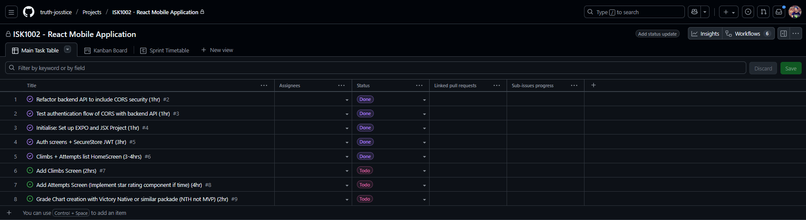
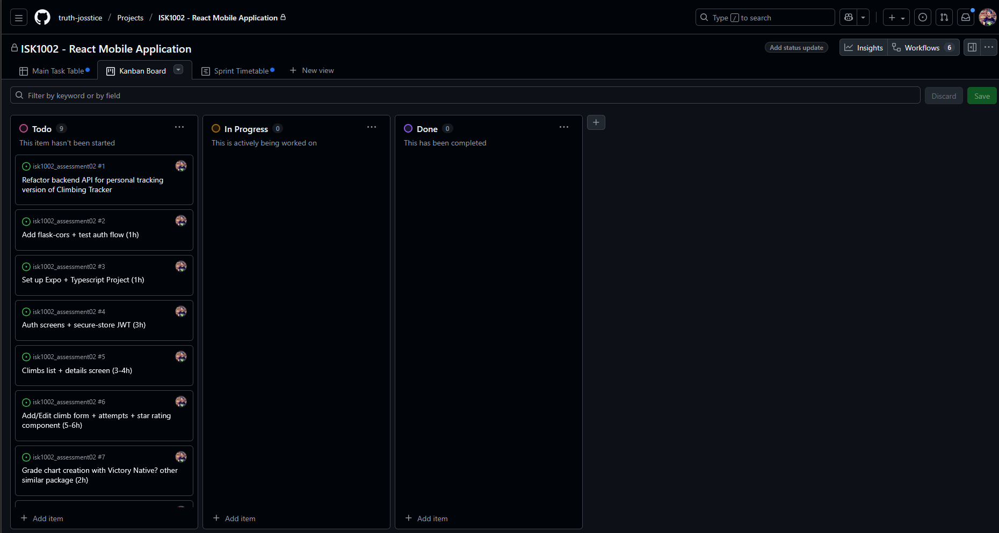
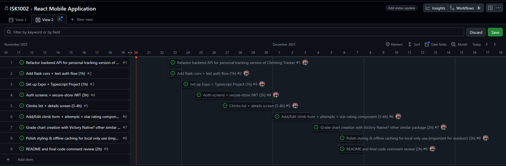

# The Problem With Fitness Apps

## Fitness Apps Trending Globally

Personal fitness tracking apps are quickly becoming a large share of the application market, with estimations of the global market size at USD $10.59 billion as of 2024, with projections to reach USD $33.58 billion by 2033 (Grand View Research, 2025.) This growth has not been without its concerns, as data privacy has become increasingly important to users of applications across the global market trust in businesses handling of biometric data is low in Australian consumers (OAIC, 2023), the ownership of user data has seen large platforms such as Strava come under fire for leaking live location data (The Guardian, 2025) . Paywalling and subscriptions also prevent some users accessing services which can help lead healthy lives, and larger fitness companies such as Garmin, Polar and Strava seem to be moving increasingly toward the services model (Song V, 2025).

## An Ethical Fitness Application

As data privacy continues to evolve, it is the responsibility of developers to follow strict ethical and legal obligations concerning the collection and proliferation of user data. As this application will collect personal data in multiple forms, it will fall under the General Data Protection Regulations (GDPR), will require consent from the user to collect only necessary data, notify of any breaches, and will not transfer user data to any third parties (OAIC, 2025).

## Ethical Development In Practice

The goal of my project was to create a simple interface for personally logging rock-climbing/bouldering progress, designed in accordance with industry standards for user data protection and transparency (Association for Computing Machinery, 2018, section 2.9), as a free alternative to paid, subscription, or ad supported services (section 1.1) such as Mountain Projects or 8a.nu, which would be accessible offline. The code base of this project would be accessible to anyone, and would share no data with third parties (section 1.6). (ACM, 2025.)

## References

| References                                                                                                                                                                                                                                                                                                                                                                                                                       |
| -------------------------------------------------------------------------------------------------------------------------------------------------------------------------------------------------------------------------------------------------------------------------------------------------------------------------------------------------------------------------------------------------------------------------------- |
| Grand View Research. (2025). _Fitness App Market Size, Share & Trends Analysis Report_. Grand View Research. Available at: <https://www.grandviewresearch.com/industry-analysis/fitness-app-market> (Accessed: 20 November 2025).                                                                                                                                                                                                |
| Office of the Australian Information Commissioner. (2023). Australian Community Attitudes to Privacy Survey 2023. OAIC. Available at: <https://www.oaic.gov.au/engage-with-us/research-and-training-resources/research/australian-community-attitudes-to-privacy-survey/australian-community-attitudes-to-privacy-survey-2023#section-part-5-digital-technologies> (Accessed: 20 November 2025)                                  |
| The Guardian. (2025). _Swedish PM’s safety put at risk by data from Strava exercise app_. Available at: <https://www.theguardian.com/world/2025/jul/08/swedish-pm-safety-strava-data-bodyguards-ulf-kristersson-running-cycling-routes> (Accessed: 20 November 2025).                                                                                                                                                            |
| Song, V. (2025). _Garmin and Polar’s fitness subscription tariffs are under investigation_. The Verge. Available at: <https://www.theverge.com/news/647055/garmin-polar-subscriptions-tariffs> (Accessed: 20 November 2025).                                                                                                                                                                                                     |
| Association for Computing Machinery. (2018). _ACM Code of Ethics and Professional Conduct_. Available at: <https://www.acm.org/code-of-ethics> (Accessed: 20 November 2025).                                                                                                                                                                                                                                                     |
| Office of the Australian Information Commissioner. (2025). _Australian entities and the European Union General Data Protection Regulation_. Available at: <https://www.oaic.gov.au/privacy/privacy-guidance-for-organisations-and-government-agencies/more-guidance/australian-entities-and-the-european-union-general-data-protection-regulation#section-what-information-does-the-gdpr-apply-to> (Accessed: 20 November 2025). |

---

## Planning

As I am starting this project with an existing backend, the initial phase of the project will be tailoring my API to the personal tracking purpose of the mobile application. As I have also learned more about security standards, I will be implementing improvements to existing code wherever possible, including implementing CORS. As I am already familiar with JavaScript and JSX, and have access to components which I already created for my previous assessment, I will be sticking to that language throughout this project.

This will be a mobile only application, so I will be using and refactoring similar components I have built in my previous assessment. This allows me to truncate development, and also to focus on functionality and actual use rather than breakpoints and responsive design.

I have used GitHub projects for the first time, and will look to link all planned stages of this project with Pull Requests directly attached to issues in my project.

