# Climbing Tracker of Truth and Josstice


This project is a relational database app which tracks user progression of bouldering across a variety of Climbing Gyms.

---

## Table of Contents

1. [Purpose](#purpose-of-the-project)
    - [Detailed Description](#detailed-description)
    - [Entity Relationship Diagrams](#diagrams)
    - [Database Management](#choosing-a-database-system)
      - [SQL](#sql-and-structure-relationships)
      - [ACID v BASE](#acid-vs-base)
      - [NoSQL](#why-not-nosql)
    - [Database Management System](#database-management-system)
2. [Installation Guide](#installation-guide)
    - [System Requirements](#system-requirements)
    - [Quick Start](#quick-start)
    - [Set Up Guide](#setup)
3. [Testing](#testing)
    - [Unit Tests](#unit-testing)
    - [API Tests](#api-testing)
4. [Deployment](#deployment)
    - [Architecture](#architecture)
    - [Steps to Deployment](#steps-to-deployment)
    - [Production Considerations](#production-considerations)
    - [Live Deployment](#live-deployment)
    - [Continuous Deployment](#continuous-deployment)
    - [The Deployment Journey in Pictures](#the-deployment-journey-in-pictures)
5. [Features and Functionality](#functionality)
    - [CRUD OPERATIONS](#crud-operations)
      - [Create](#create)
      - [Read](#read)
      - [Update](#update)
      - [Delete](#delete)
6. [Usage Instructions](#usage-instructions)
    - [CLI Commands](#cli-commands)
    - [API Endpoints](#api-endpoints)
7. [Dependencies](#dependencies)
8. [Ethical Considerations](#ethical-considerations)
9. [Privacy Policy](#privacy-policy)
10. [Future Development](#future-development-goals)
11. [Contributions](#contributions)

---

## Purpose of the Project

This project is created as an assessment for unit DEV1002 of CoderAcademy's FullStack Web Development Boot Camp course. The assessment calls for the creation of a web server linked to a chosen database system. This is designed to ensure a thorough practical application of Database and Server studies, as well as increasing exposure to planning and feedback gathering.

The web server is designed for climbers!

The intended use is to allow users to track progression of their climbing, and to allow non users to see gym ratings to choose a gym that will work for their skill level. Initially the app will rely on users posting data, and only allow users to track their own climbs and attempts. Future development would see the creation of admin roles, allowing for dedicated users to create climbs for a whole gym's set each week.

### Detailed Description

Climbing is an incredibly subjective sport, with a wide variety of skill levels and understanding of climbing terminology, styles of boulder problems, and even of the difficulty grading systems used across multiple gyms. As there is an extreme level of diversity between gyms in Australia, even in Melbourne alone, the majority of data collected is created directly by the users.

Companies which operate gyms often operate multiple locations, but have a centralised website. At the moment there is very little in regard to widely circulated information about the climbs at each gym. Due to this subjectivity I have allowed for users to add their own climbs, as two users may view a climb completely differently depending on skill level and personal style.

One example of a fully realised version of this project is [toplogger](app.toplogger.nu). An app at this scale with an included front end is not currently within my abilities, but is the idealised final product. A major difference between toplogger and my project other than scale, is to allow users to comment on their own climbs, allowing for reflection on progress in a more journalised way. Many climbers experience a plateau or perceived plateau in their climbing abilities at the intermediate level. However incremental increases on particular styles, problems, moves can be logged a little more clearly with the ability to include a fun rating and comments on each attempt.

New climbs are set each week under most normal circumstances, and there can be any number of new climbs on the same amount of wall space at each gym. Difficulty gradings are also not standardised amongst all gyms, and between different countries and continents there are different "standard" difficulty scales used. For the purposes of this app the gym's chosen grading styles will be used (eg. Northside use colour grading system "Yellow" being easiest "Black" being most difficult, BlocHaus use colour grading "Blue" being the easiest "White" being the most difficult, BoulderLab use numbered grading system "1" being the easiest "10" being the most difficult.)

Gyms also vary in the skill levels which are catered for, some gyms offer climbs which are graded as low difficulty but are actually objectively more difficult than other gyms and vice versa. Therefore users are able to recommend the skill level of gyms with their ratings and leave a review with more detail if they would like.

**Primary function:**  
*An app for climbers to check their own progress across multiple gyms.*

Users will create an account with a username and password, which will be linked to all of their personal climbing data. Climbers will first add the climb they are going to work on, including the gym, the style they perceive for the climb, the difficulty grade assigned by the gym, and the date it was set if known. They will then log their attempts on the climb, including a rating of how fun the climb was for them, any comments about the climb and their progress, whether it was completed or not, and finally the date of the attempt. Most users will not carry their phone with them as they are climbing, but can log attempts at a later date or after the session is finished.

**Secondary function:**  
*Allows users to give gyms ratings, and all visitors to check listed gym's difficulty/skill level.*

Users will login and create reviews for the gyms they climb at. The reviews will be for particular gym locations, and will include an overall difficulty rating, as well as a recommended skill level for anyone wishing to climb at the gym. Non-user visitors will be able to check out these reviews individually or to view aggregated results. All users will also be able to check out which gyms a company operates and where they are located.

**User Stories:**  
A *climber* wants to *mark which climbs they have attempted at which gyms, mark it as completed when completed, and check their progression over time so they can keep a record of climbs they have completed, and their comments/reflections on difficult problems* to *track their progression over time*.

Example PostgreSQL output:

```text
 id | user_id | climb_id | fun_rating |                comments                 | completed | attempt_date 
----+---------+----------+------------+-----------------------------------------+-----------+--------------
  1 |       1 |        1 |          4 | This was hard, almost have it           | f         | 2025-02-01
  2 |       1 |        1 |          4 | This was fun! Got it on my second visit | t         | 2025-04-01
  3 |       2 |        3 |          4 | Almost there! just need to try again    | f         | 2025-05-01
  4 |       2 |        3 |          5 | Sent it weeeheew                        | t         | 2025-05-01
  5 |       2 |        4 |          5 | Flashed it!                             | t         | 2025-05-01
```
  
A *beginner climber* wants to *check the difficulty rating of gyms*,  to *pick a beginner friendly gym, and track their progress to see if they improve over time*.

Example PostgreSQL output:

```text
 id | gym_id | user_id | difficulty_rating | recommended_skill_level |                                 review                                  
----+--------+---------+-------------------+-------------------------+-------------------------------------------------------------------------
  1 |      1 |       1 |                 7 | Beginner                | This gym is great for all skill levels, it's beginner friendly
  2 |      2 |       2 |                10 | Intermediate            | This gym has some tough climbs, even the easiest are intermediate level
```

↑ [Back to Top](#climbing-tracker-of-truth-and-josstice)

---

## Diagrams

The data for this project is presented in a non-normalised format below:

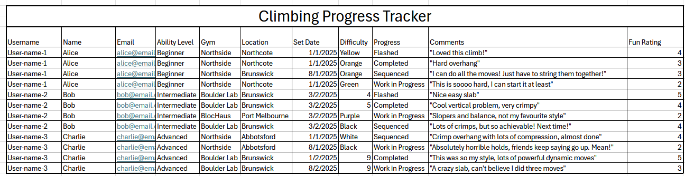

Here is the plan with entities, attributes, relationships.

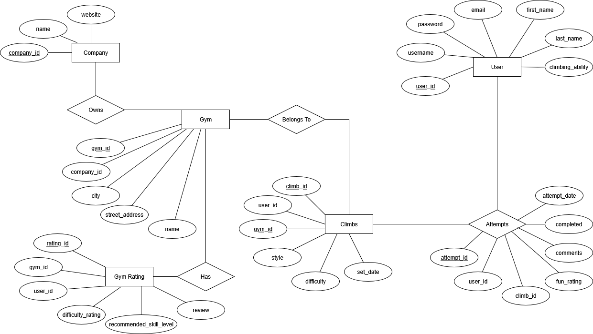

Here is an ERD with cardinality included for all tables.

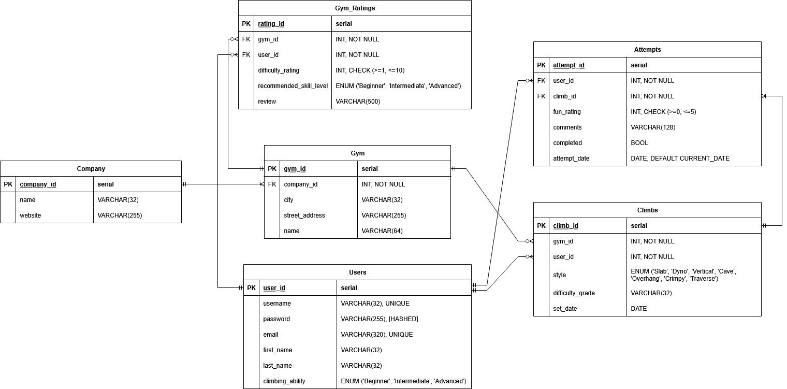

After receiving [Feedback from Jordan](./contributions/feedback/Feedback%20Log.md) the ERD was revised to reflect all NOT NULL columns, as well as more appropriate VARCHAR limits.

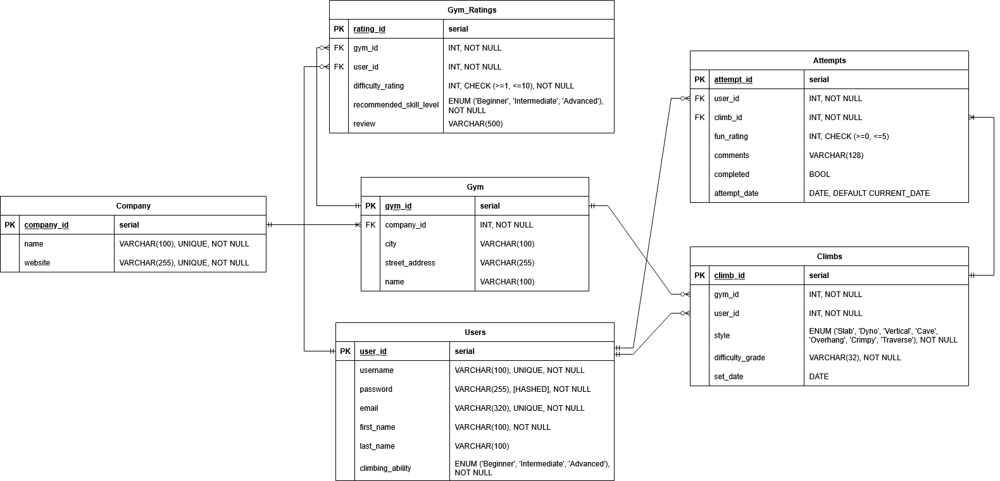

After receiving [Feedback from Nhi](./contributions/feedback/Feedback%20Log.md) the ERD was again revised to reflect all new lookup tables and limit changes wherever appropriate.

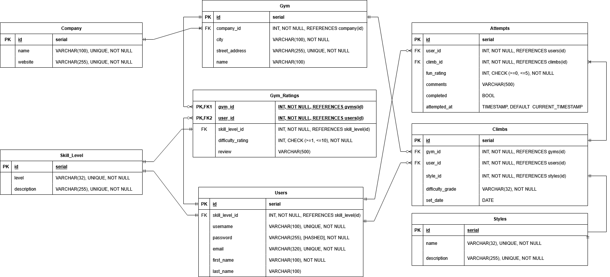

After finalising the database relationship structure and processing all feedback the final ERD looks like this:

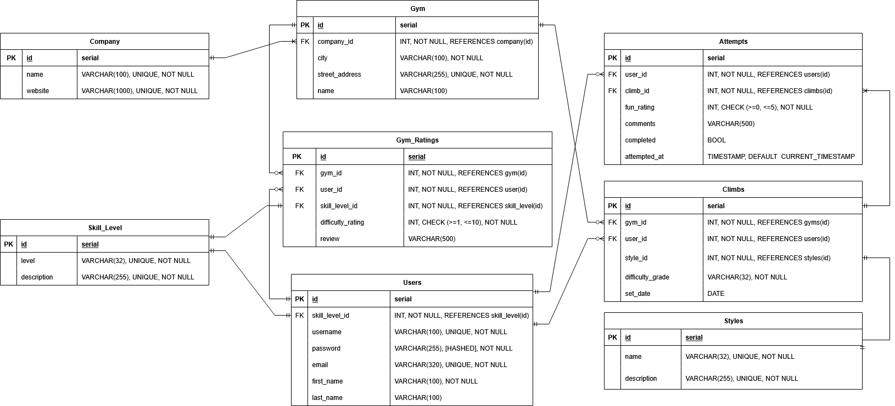

↑ [Back to Top](#climbing-tracker-of-truth-and-josstice)

---

## Choosing a Database System

### SQL and Structure Relationships

Pictured in my ERD are the below relationships:

- Company connects to Gym
- Gym connects to Climbs and Gym_Ratings
- Users connects to Attempts, Gym_Ratings, and Climbs
- Climbs connects to Attempts

As I have many related tables to consider in this project, with the User and Gym entities being closely related to multiple other entities, the clearly structured nature of a Relational Database is ideal to ensure the data integrity of these related tables. All connections must be Valid, for example an Attempt cannot exist without a User or Climb. This also protects the database from orphaned records, as upon deleting a Gym, all associated Climbs will be deleted.

In addition, my database uses enumerated data (ENUM) and validation checks which are natively enforced in a relational database.

At the current scale of the project (where I expect a number in the realm of thousands of records), a relational database system with strong ACID compliance is ideal. All attempts and ratings are atomic (all or nothing), so if at any point a server crash occurs, there will be no partial records which could threaten the integrity of the database.

SQL queries for this database are lightweight, able to be enacted using simple joins.

A feature of the app is to allow users to ONLY view their own climbs. Native support for UNIQUE constraints, ACID protection of password and username creation, and strict schema validations (such as for password hash length) is a benefit for creating authorisations.

Relational databases are more easily integrated with other tools to auto-hash passwords.

In future if the scale of the app continues to grow, the addition of roles such as admin/owner are more easy to create and manage.

### ACID vs BASE

ACID compliant databases ensure that all transactions (any collection of operations which form a single logical unit of work) are consistent regardless of any external or internal interruptions. The foundations of ACID are the following:

1. Atomicity - Transactions either occur or do not occur, there is no possibility of partial transactions taking place
2. Consistency - All transactions occur without adverse affects on the data in the database, the database must be consistent before and after a transaction occures
3. Isolation - If more than one transaction occurs simultaneously, they will be executed completely individually from each other, and no transaction can affect any other transaction
4. Durability - Any transactions which occur but are not commited are held until they can be correctly commited without any adverse effects on the database

Relational database management systems are the only recommended systems for ACID compliance.

BASE modelled databases are more recent, and have increased in popularity with the development of NoSQL (non-relational) databases. The foundations of BASE are as follows:

1. Basically Available - Instead of ensuring data integrity, BASE modelled databases prefer the information be spread throughout the database first, making the data available as a priority
2. Soft State - The data values may change over time, and validation and consistency are manually enforced by the developers instead of by the management system
3. Eventually Consistent - Data reads can occur before all consistency has been implemented by the developers, but the data reads may not reflect accurate and real data

My project has strictly enforced relationships and data types, as well as the need for hashing and encryption of some data. There is also the opportunity for multiple users to transact at the same time. Due to these necessary constraints, an ACID compliant database management system is a much more appropriate choice for my system. Further details in regard to why a NoSQL database is inappropriate for my web server see below.

### Why Not NoSQL?

A non-relational database would be more appropriate if I required horizontal scalability (was expecting a high number of records in the millions), or if the data being stored was arbitrary or unstructured.

Validation and simple relationships in a NoSQL database require a much larger codebase, and add a lot of unnecessary work. For ENUM and CHECK constraints, a lot of application side checks and extra code would be required to achieve the same level of validation. This means unless you take extra steps with extra code, users can enter incorrect data which would affect any visitors to the site looking for objective data.

Querying data based on the relationships described in my ERD would involve much more complicated queries, which presents more risk for error on the application side.

NoSQL Databases do not enforce foreign key cascading natively, meaning upon deletion of records, querying a non-existant record can lead to errors.

In future a hybrid format including Non-Relational Database systems for Climbs and Attempts could be cool, especially if I wanted to include the ability to post a photo of a climb, or other types of but for the beginning of this app I will focus purely on Relational Databases.

↑ [Back to Top](#climbing-tracker-of-truth-and-josstice)

---

## Database Management System

I will be using the PostgreSQL as my DBMS for this project, and SQLite for any error testing, as I am studying this in my CoderAcademy course, and have used SQLite for error testing in my classwork.

I will compare the strengths and weaknesses of PostgreSQL and MySQL below in the context of my project, as well as describing the strengths and weaknesses of SQLite. The reason I have chosen these three to compare due to the scale of the project I am working on, and my familiarity with them through my classwork and research, as in particular PostgreSQL and MySQL have wide community usage and discussion. I have chosen SQLite as it is ideal for testing due to its ability to work offline and not demand any resources from the server itself.

**PostgreSQL Strengths:**

- Allows use of JSON, custom data types and advanced joins
  - My project will require multiple related datapoints to be accessed to form one table, and all body data will be sent and received in JSON format
- Supports and encourages strict data integrity, especially useful for ENUM and foreign key data
  - My project will have some enumerated choices, and plenty of foreign key data across my tables, I can more easily constrain these data types using PostgreSQL
- More scalable than MySQL for heavy record loads
  - At the point at which multiple users would be creating records, this will be help to ensure the application is viable
- Always rejects invalid data, and will log errors when invalid data occurs
  - Ensures that the database will not crash due to incorrectly entered user data, and will allow me to enact fixes quickly and efficiently when they occur

**PostgreSQL Weaknesses:**

- Harder to setup than SQLite
  - As I already have familiarity with PostgreSQL and have setup completed, I do not face a challenge here

**MySQL Strengths:**

- Great for simple web apps with fast read requirements
  - Read requirements are not time sensetive in my application
- Faster for read-heavy loads, though due to the scale of the project this is neglible
  - Most of the traffic will be transactional and there is not a high scale of users for this application in its current form
- Easier setup
  - As I have already setup PostgreSQL this is moot

**MySQL Weaknesses:**

- Less strict data validation by default, and does not warn when invalid data is entered.
  - Example:
    - username is valid if 100 or below characters.
    - user enters a username of 120 characters
    - MySQL will truncate the data to 100 characters but not flag this by default
    - user now has a username which no longer matches their entry
    - no error is logged by default, so fixing corrupt or invalid data is more difficult
  - My application requires user login, and if the username is truncated without the user or myself as the dev knowing, this will cause an error for the user with no clear fix

**SQLite Strengths:**

- Best for tiny apps with low or no network traffic
  - I will be using this to test my applications features without demanding any server resources
- No setup or server requirements
  - See above
- Great for testing due to its discrete nature
  - See above

**SQLite Weaknesses:**

- No user authentication or built in user management
  - For my application user authentication will be required
- No concurrent data writing will cause failures if multiple users edit data at once
  - Multiple users transacting at the same time is a key feature of my application, therefore this means my app would not be able to function if created using SQLite

↑ [Back to Top](#climbing-tracker-of-truth-and-josstice)

---

## Functionality

### CRUD Operations

#### Create

- Visitors:
  - Create user profile with unique email, username, with password login
- User exclusive:
  - Add gym ratings for each gym
  - Add climbs as they are set
  - Add attempts when attempting climbs at gyms
- Admin exclusive:
  - Create all entities as required

#### Read

- Visitors:
  - See overall gym ratings
  - See individual gym reviews
  - See all gym reviews
  - See gym information
  - See company information including website
  - See a list of climbs posted by users
  - See a list of skill levels
  - See a lits of styles
- User exclusive:
  - See their user profile
  - See all attempts connected to their account
- Admin exclusive:
  - See all entitites as required

#### Update

- Visitors:
  - Not authorised for any update functions
- User exclusive:
  - Update climbs they have posted
  - Update their user information
  - Update any reviews they have created
  - Updating attempts is not how this API is intended to function
- Admin exclusive:
  - Update all entities except for reviews (to avoid changing user's input, though deletion is still an option if reviews are not in the spirit of the app or are inappropriate)

#### Delete

- Visitors:
  - Not authorised for any delete functions
- User exclusive:
  - Delete their own user profile and all associated relationships
  - Delete gym ratings
  - Delete any climbs associated with their account
  - Deleted attempts is not how this API is intended to function
- Admin exclusive:
  - Delete any and all entities as required

### Privileges & Tokens

**Admin**:  
User records have a boolean "is_admin" column, defaulting to false on the creation of their account.  

**Token**:  
All routes which require a user require an authorization token in the header.

**Visitors**:  
Anyone who accesses the site access areas not requirign a token.

↑ [Back to Top](#climbing-tracker-of-truth-and-josstice)

---

## Installation Guide

---

### System Requirements

- At least 100MB of local Disk Space for the application
- 50-100MB of local Disk Space for the databse

- Python 3.10+ (3.12 recommended)
- PIP (python package installer)
- Windows, Linux, WSL or MacOS
- PostgreSQL shell 16.9+ (16.9 recommended)
- Active internet connection for cloning dependencies

---

> **IMPORTANT: Make sure to follow the steps for your specific system to avoid command errors or path issues.**
> ***IF* you receive errors on bash systems when entering commands, please try 'python' instead of 'python3'.**

---

### Quick Start

For experienced users:

1. `git clone https://github.com/truth-josstice/dev1002_assessment03`
2. `cd dev1002_assessment03`
3. `python -m venv .venv`
4. `source .venv/bin/activate` (or `.\.venv\Scripts\activate.ps1` on Windows)
5. `pip install -r requirements.txt`
6. Set up `.env` file as per `.env.example` file
7. `flask db drop && flask db create && flask db seed`
8. `flask run`

---

### Setup

1. **Verify Python Version**

    - Linux/WSL/Mac users

      ```bash
      python3 --version  # Should display Python 3.10 or higher
      ```

    - Windows users

      ```powershell
      python --version # Should display Python 3.10 or higher

      py --version # If the above does not work
      ```

2. **Choose one of the following methods:**
   - Download and extract the ZIP folder to your desired directory
   **OR**
   - Clone directly from [this github repository](https://github.com/truth-josstice/dev1002_assessment03)

      ```bash
      git clone https://github.com/truth-josstice/dev1002_assessment03
      cd dev1002_assessment03
      ```

3. **Create and Activate Virtual Environment**
  
    - Linux/WSL/MacOs users

      ```bash
      python3 -m venv .venv  # Creates virtual environment
      source .venv/bin/activate  # Activates virtual environment
      ```

    - Windows Users

      ```powershell
      python -m venv .venv # Creates virtual environment
      .\.venv\Scripts\Activate.ps1 # Activates virtual environment
      ```

4. **Install Dependencies**

   ```bash
   pip install -r requirements.txt  # Depending on pip version, pip3 may be required instead
   ```

5. **Create a .env and .flaskenv file with the variables included in the .example files.**

   - Set up DATABASE URI:

     ```text
     DATABASE_URI with string connected to your PostgreSQL database
     ```

   - Set up a SECRET_KEY variable by running the below code, or following another safe encryption protocol:

     ```python
     python3 -c 'import os; print(os.urandom(16))'
     ```

6. **Ensure that a local database exists by creating one in the PostgreSQL shell:**

    - Enter the PostgreSQL shell:

       ```bash
       sudo -u postgres psql # Linux and WSL users
       ```

       ```bash
       psql # MacOS users
       ```

       ```bash
       psql -U postgres # Windows users
       ```

    - List all existing databases by running:

       ```SQL
       \l
       ```

    - If the database you want to connect to does not exist, create it by running:

       ```SQL
       CREATE DATABASE climbing_tracker_db; --> If you want to name your database differently, ensure it is matched elsewhere in this setup guide
       ```

    - Verify it exists by listing databases `\l`

7. **Ensure a user with the correct permissions exists in your database:**

    - In the PostgreSQL shell, run the following command:

       ```SQL
       CREATE USER <your_username> WITH PASSWORD '<your_password>';
       ```

    - Grant the user permissions needed to work with public schema and database:

       ```SQL
       GRANT ALL PRIVILEGES ON DATABASE climbing_tracker_db TO <your_username>; --> Grants CRUD functions for database to user, change the database name here if changed in step 6
       GRANT ALL ON SCHEMA public TO <your_username>; --> Grants table CRUD functions to user
       ```

    - Close the PostgreSQL shell using `\q`

↑ [Back to Top](#climbing-tracker-of-truth-and-josstice)

---

## Testing

### Unit Testing

Unit testing of selected models, schemas and cli commands was completed using `pytest`.

The tests are performed on an `SQLite` in-memory database to ensure fast execution, reduced server load, isolation between tests, integrity and sanitastion of project database, and automatic rollback after testing.

**Test Structure:**  

- Model Tests: Verify model data integrity and relationships
  - User Creation and validation
  - Company creation and validation
  - Company-Gym relationship testing
  - Cascade deletion functionality
- Schema Tests: Ensure JSON serialization & deserialization is successful or raises errors where needed
  - User schema serialization with password exclusion
  - Company schema validation
  - JSONification of data
  - Custom formatting of data
  - Input validation error handling
- CLI command tests: Verify database commands
  - Table dropping and creation
  - Table seed data functions
  - Command output verification
- Auth token testing: Checks creation and application of auth tokens
  - Creation of bearer token
  - Access to secure routes
  - Correct unauthorized response with no auth token

**Running Tests:**  

```bash
# Run all tests
pytest

# Run specific files
pytest tests/<test_file_name>.py

# Run with verbose output
pytest -v
```

**Key Test Features:**  

- Password security: Tests passwords are never exposed in output schemas
- Relationship integrity: Validates models with relationships work correctly
- Validation errors: Tests error handling for invalid data
- Cascade operations: Tests delete operations and data integrity

### API Testing

Testing of routes and methods was completed using Insomnia.

**Testing Focus:**  

- CRUD Operations: Create, Read, Update, Delete functions
  - Ensuring correct HTTP Verbs and methods for routes
- Authentication: Bearer token-based auth validation
- Error handling: Proper HTTP status codes and error messages
- Data validation: Input sanitation and validation
- Relationship endpoints: Nested and aggergate resources

↑ [Back to Top](#climbing-tracker-of-truth-and-josstice)

---

## Deployment

This project has been successfully deployed using the following services:

### Architecture

- Backend: Python Flask application served with Gunicorn
- Database: Neon PostgreSQL
- Platform: Render
- Environment Variables: Managed through Render's secure environment config

### Steps to Deployment

1. Database setup on [Neon](https://neon.com)
    - Create a new project in Neon
    - Obtain your connection string from the Neon dashboard
    - Format: postgresql://<your_db_user>:<your_password>@ep-cool-water-123456.us-east-2.aws.neon.tech/<your_dbname>
      - Note: default values and variables are illustrated here, your connection string may vary
2. Database migration to Neon:
    - DATABASE_URI in .env file must be set to Neon database string
    - Database commands can be completed using `flask db create`, `flask db seed` and `flask db drop`
      - If any errors occur during flask commands, ensure your database user and password match those of your user in PostgreSQL database for the project
3. Render configuration:
    - Connect to Render using your GitHub repository
    - Set start command to `gunicorn main:create_app()`
    - Add required variables to Render web service:
      - DATABASE_URI: Connection string from Neon
      - JWT_SECRET_KEY: Strong random secret key (see [setup guide](#setup) step 5 for example)

### Production Considerations

**Security:**

- Sensitive data is stored securely in environment variables through Render's web service hosting

**Monitoring:**

- Application logs available through Render's dashboard
- Database can be monitored using Neon's dashboard

### Live Deployment

The application is currently live at: [https://climbing-tracker-of-truth-and-josstice.onrender.com/]

[Deployment Logs](./logs/DEPLOYMENT_LOG.md) can be found in the linked file!

### Continuous Deployment

- The setup for my deployment supports automatic deployments from GitHub: pushes to main branch will trigger new build
  - Example:
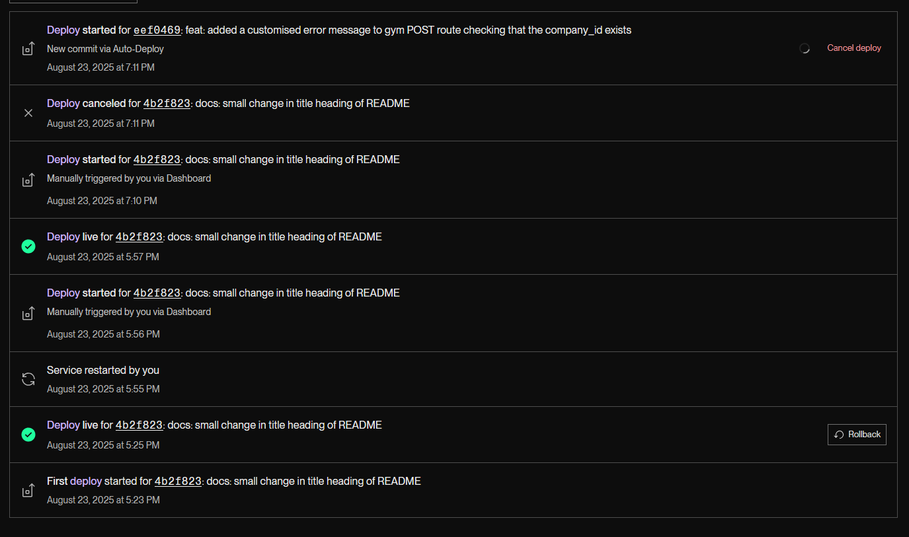
- It does not currently support database schema changes to the deployed environment, creation of `flask db migrate` and `flask db update` would be necessary for this to occur to ensure database integrity
- Any new database operations should be tested in a local development environment first to ensure deployed database integrity

### The Deployment Journey in Pictures

The successful hosting of my PostgreSQL database on Neon:
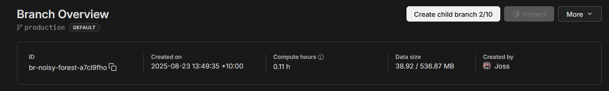

The successful deployment of my API on Render:
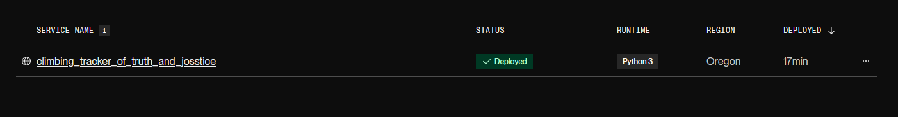

Checking out the /gyms/ route on Render:
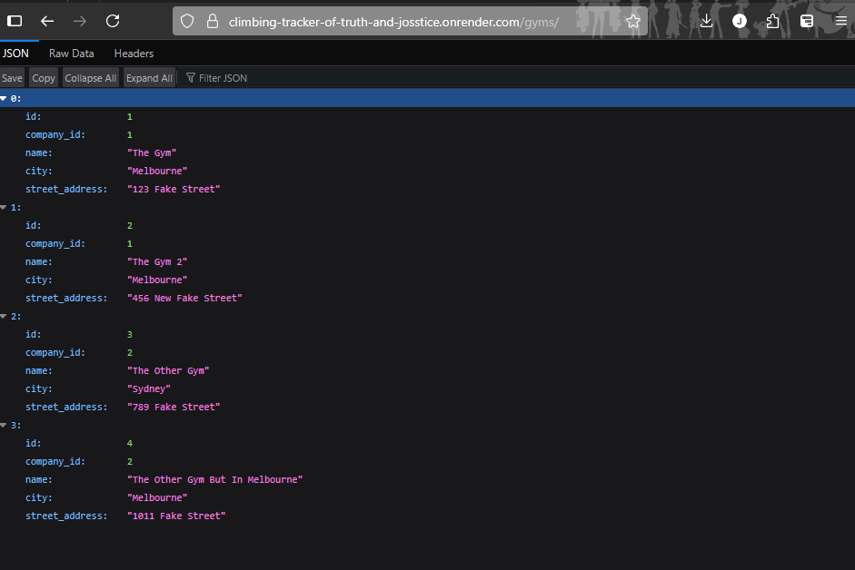

Checking out the /climbs/ route on Render:
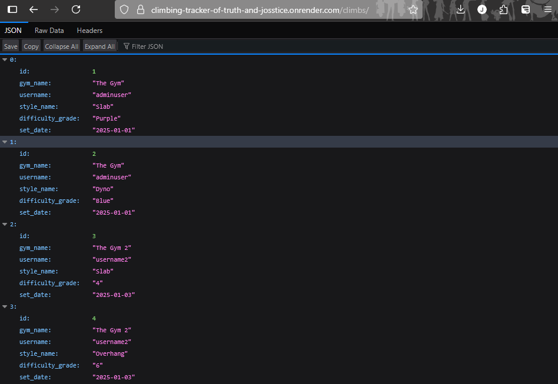

Checking out the /gym_ratings/ route on Render:
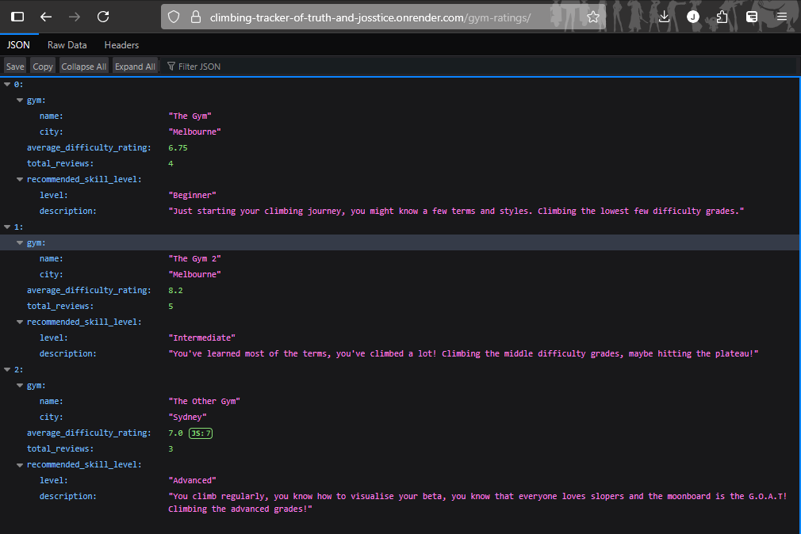

### Deployment Conclusion

I was really worried about how this would work, as it seemed like linking so many separate services together would be difficult or complicated. It was actually a real breeze! I just followed the steps from our lesson deployment and it just...worked! After so many random errors through the build of the app I thought I might have no luck when it came to deployment but boy howdy was I wrong!  

I think the main challenge with this API in future will be adding any new tables to the database, though I can already see the correct way to do that, it's just practice practice practice!

↑ [Back to Top](#climbing-tracker-of-truth-and-josstice)

---

## Usage Instructions

### CLI Commands

1. **Ensure the Flask database app exists by entering the following commands in bash terminal:**

   ```bash
   flask db drop # Drops all tables if they exist
   flask db create # Creates all tables
   flask db seed # Seeds data to tall tables
   ```

2. **Run the Application**

   ```bash
   flask run
   ```

3. **Close Flask and Deactivate Virtual Environment when Finished**

   ```bash
   CTRL+C # Keyboard interrupt to stop flask application
   ```

### API Endpoints

See [API DOCUMENTATION.md](./API%20DOCUMENTATION.md) for full list of endpoints and descriptions.

---

## Ethical Considerations

### Data Privacy and Player Protection

User Data Security (ACM 1.6 - Respect Privacy):
"...This requires taking precautions to prevent re-identification of anonymized data or unauthorized data collection, ensuring the accuracy of data, understanding the provenance of the data, and protecting it from unauthorized access and accidental disclosure".

This application obligates users to provide sensitive user information such as email address, first and last name, as well as creating a secure password. In its current form this project uses dummy data to seed tables, and will provide a framework for the creation of user profiles using these parameters. It is not recommended that any sensitive information is added at this stage of development.

- The current project does not use any real user data, only using seed data as a proof of concept, carrying no privacy risk
- The current project implements password hashing using bcrypt to ensure even in this state passwords are not stored stored in the database in plain text format
- Future developments would include implementation of data encryption to ensure anonymity in the event of accidental or malicious database access or disclosure (see [future developments](#future-development-goals) for further detail)

↑ [Back to Top](#climbing-tracker-of-truth-and-josstice)

---

## Dependencies

### Third Party Packages/Libraries Licenses

| **Package/Library**          | **Version** | **License** | **Purpose** |
| :--------------------------: | :---------: | :---------: | :---------: |
| `bcrypt`                     | 4.3.0       | [Apache 2.0](https://www.apache.org/licenses/LICENSE-2.0) | Password hashing and security |
| `blinker`                    | 1.9.0       | [MIT](https://opensource.org/license/MIT) | Event signaling for Python apps |
| `click`                      | 8.2.1       | [BSD-3-Clause](https://opensource.org/license/BSD-3-Clause) | Command-line interface toolkit |
| `Flask`                      | 3.1.1       | [BSD-3-Clause](https://opensource.org/license/BSD-3-Clause) | Web framework |
| `Flask-Bcrypt`               | 1.0.1       | [BSD-3-Clause](https://opensource.org/license/BSD-3-Clause) | Flask integration for bcrypt |
| `Flask-JWT-Extended`         | 4.7.1       | [MIT](https://opensource.org/license/MIT) | JWT authentication for Flask |
| `Flask-SQLAlchemy`           | 3.1.1       | [BSD-3-Clause](https://opensource.org/license/BSD-3-Clause) | Flask integration for SQLAlchemy |
| `greenlet`                   | 3.2.3       | [MIT](https://opensource.org/license/MIT) | Lightweight coroutines |
| `gunicorn`                   | 23.0.0      | [MIT](https://opensource.org/license/MIT) | Production WSGI server |
| `iniconfig`                  | 2.1.0       | [MIT](https://opensource.org/license/MIT) | Configuration file parsing for pytest |
| `itsdangerous`               | 2.2.0       | [BSD-3-Clause](https://opensource.org/license/BSD-3-Clause) | Secure data serialization |
| `Jinja2`                     | 3.1.6       | [BSD-3-Clause](https://opensource.org/license/BSD-3-Clause) | Templating engine |
| `MarkupSafe`                 | 3.0.2       | [BSD-3-Clause](https://opensource.org/license/BSD-3-Clause) | HTML/XML string safety |
| `marshmallow`                | 4.0.0       | [MIT](https://opensource.org/license/MIT) | Object serialization/deserialization |
| `marshmallow-sqlalchemy`     | 1.4.2       | [MIT](https://opensource.org/license/MIT) | SQLAlchemy integration for marshmallow |
| `packaging`                  | 25.0        | [Apache 2.0](https://www.apache.org/licenses/LICENSE-2.0) or [MIT](https://opensource.org/license/MIT) | Package version utilities |
| `pluggy`                     | 1.6.0       | [MIT](https://opensource.org/license/MIT) | Plugin system for pytest |
| `psycopg2-binary`            | 2.9.10      | [LGPL-3.0](https://www.gnu.org/licenses/lgpl-3.0.html) | PostgreSQL adapter for Python |
| `Pygments`                   | 2.19.2      | [BSD-2-Clause](https://opensource.org/license/BSD-2-Clause) | Syntax highlighting |
| `PyJWT`                      | 2.10.1      | [MIT](https://opensource.org/license/MIT) | JWT encoding/decoding |
| `pytest`                     | 8.4.1       | [MIT](https://opensource.org/license/MIT) | Testing framework |
| `python-dotenv`              | 1.1.1       | [BSD-3-Clause](https://opensource.org/license/BSD-3-Clause) | `.env` file loader |
| `SQLAlchemy`                 | 2.0.41      | [MIT](https://opensource.org/license/MIT) | ORM and database toolkit |
| `typing_extensions`          | 4.14.1      | [PSF-2.0](https://opensource.org/license/psf-2-0/) | Backported type hints |
| `Werkzeug`                   | 3.1.3       | [BSD-3-Clause](https://opensource.org/license/BSD-3-Clause) | WSGI utilities (Flask dependency) |

---

### License Versions

Each library is open-source and licensed to allow for educational and personal use under their respective licenses. I acknowledge and respect the work of the open-source community in making these tools available. For more details on each license, please visit the respective project pages on PyPI or via their official repositories.

---

### Security Impacts

| **Package/Library**          | **Potential Risks** | **Mitigation Used** |
| :--------------------------: | :-----------------: | :-----------------: |
| `bcrypt`                     | Brute-force attacks on weak passwords during development testing | Enforce strong default passwords for test users, bcrypt hashing factor 12 to meet minimum standards |
| `Flask`                      | Accidental exposure of debug endpoints or information | **CRITICAL:** Disable `debug=False` before deployment. Use `python-dotenv` for config, never hardcode secrets. |
| `Flask-Bcrypt`               | Incorrect password hashing setup leading to weak storage | Verify password hashing and comparison works correctly in unit tests |
| `Flask-JWT-Extended`         | Testing with insecure tokens or overly long expirations | Use short expiration times (e.g., 15 mins) for tokens. Use strong `JWT_SECRET_KEY` from env var. |
| `Flask-SQLAlchemy`           | Accidental data leakage or deletion in test database | Use a separate, isolated test database. Be cautious with `db.drop_all()` and `db.create_all()`. |
| `itsdangerous`               | Token forgery if a weak default secret is used | **CRITICAL:** Set a strong `SECRET_KEY` environment variable. Do not use the Flask default. |
| `marshmallow`                | Accepting unwanted field input during API testing | Use strict schemas: define `unknown = EXCLUDE` or `RAISE` to prevent extra data. |
| `marshmallow-sqlalchemy`     | Dumping sensitive model fields in API responses | Explicitly define which fields to include/exclude in serialization schemas. |
| `psycopg2-binary`            | SQL injection in raw SQL queries during prototyping | **Avoid raw SQL.** Use SQLAlchemy ORM exclusively. If raw SQL is unavoidable, use parameterized queries. |
| `python-dotenv`              | Accidentally committing the `.env` file to version control | **IMMEDIATE ACTION:** Add `.env` to your `.gitignore` file. This is the primary mitigation. |
| `SQLAlchemy`                 | SQL injection through misuse of `text()` construct | Avoid the `text()` construct. Use the ORM or Core with named parameters if absolutely necessary. |
| `Werkzeug`                   | **Critical information disclosure** if debug mode is enabled | **CRITICAL:** The Werkzeug debugger allows arbitrary code execution. **Ensure `debug=False` for any online server.** |

## Privacy Policy

This project aspires to adhere to the Australian Privacy Principles (APP) for handling personal data. In its current form it does present vulnerabilities for sensitive information to be accessed via malitious or accidental data disclosure, however the data used as part of the project, and any data intended to be added via the server, is purely synthetic in nature and has been designed with the intention to not mimic any individual's sensitive information.

**Current Protections:**  

- Uses synthetic data only (no real user information is processed or stored)
- Implements password hashing (bcrypt) and row-level access controls as foundational security measures

**APP Alignment:**

- APP 11 (Security): Minimal protections are in place for synthetic data, with ANY future plans to reach production level to address this by encrypting sensitive information before storage
- APP 4 (Data Quality): All synthetic data is generated in order to avoid any similarity with real individuals

**Future Compliance:**

Production deployments will incorporate:

- Full encryption of personal data (APP 11) or minimization of required personal information.
- Formal processes for data access/deletion requests (APP 12), in the context of this project a removal request via email.

For further production goals please see below.

↑ [Back to Top](#climbing-tracker-of-truth-and-josstice)

---

## Future Development Goals

The app in its current version is intended for submission as an assessment for CoderAcedemy's Full Stack Web Development BootCamp course. Future development is not currently intended, however goals for future development as a full stack project would include but are not limited to the below:

- Creation of user roles:  
**Status**: Not currently implemented  
**Justification**: Scope of the application in its current form does not necessitate roles other than "user", "admin" and "visitor"  
**Future Implementation**:
Rollout of role based privileges for the app:
  - Admin: Users who will be able to create a list of climbs for their chosen gym using the standardised "V Scale" for climbs. These users would ideally be climbing gym staff and/or climbing coaches whose objective abilities to grade climb difficulty and style will ensure the accuracy of all data
  - Owner: Essentially myself, the main developer of the project who can user database level CRUD functions
  - Member: Will replace the current role-less user and all features associated, with the exception of creating climbs based in a gym, instead focussing on outdoor climbs or custom routes created on splash walls.
  - Visitor: Will replace non-logged in users, with additional access to aggregate results to see how many members have climbed particular climbs at gyms

- Robust security for personal data:  
**Status**: Not currently implemented  
**Justification**: No real user data is currently used, the required knowledge for encryption is not something which I have studied or have confidence in  
**Future Implementation**:  
  - Field-Level Encryption: encryption of 'email', 'first name', 'last name' columns before storage using PyNaCl (chosen due to being safer for beginners due to automation features and as the project is Python specific)
  - Regular security auditing: regularly scheduled audits of all sensitive data, including the logging of all sensitive data transactions
  - Create managable framework for data purging: research industry standards for data purging and deletion of private sensitive data, implement on database server side

---

## Contributions

### [lulu-codes](https://github.com/lulu-codes)

- Provided feedback on ERD and Plan for API

### [jordanleal12](https://github.com/jordanleal12)

- Provided feedback on ERD and Plan for API

Feedback from peers for this project's planning phase and how it has been implemeneted into the project can be found in the [Feedback Log](./contributions/feedback/Feedback%20Log.md) file.

---

↑ [Back to Top](#climbing-tracker-of-truth-and-josstice)
